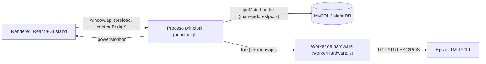
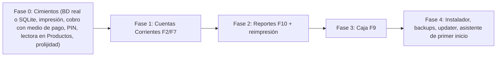

# RESUMEN MAESTRO — El Rincón del Gato (Sistema POS)

> Documento de referencia de punta a punta. Cualquier agente o desarrollador que tome el proyecto
> debe leerlo completo antes de tocar código. Explica qué es el sistema, cómo está construido hoy,
> qué funciona y qué no (verificado contra el código y la base de datos), las reglas que pidió el
> dueño del proyecto, y cómo tiene que verse el producto terminado.
>
> Última auditoría: 04/10/2026. Zona horaria del negocio: Argentina, Neuquén, Centenario (GMT-3, sin horario de verano).

---

## Índice

1. Qué es el proyecto y para quién
2. Reglas de trabajo con el desarrollador (OBLIGATORIAS)
3. Reglas de interfaz y experiencia (OBLIGATORIAS)
4. Hardware del negocio
5. Stack tecnológico y arquitectura
6. Estructura de archivos (archivo por archivo)
7. Cómo se ejecuta hoy en desarrollo
8. Base de datos actual (tabla por tabla)
9. Canales IPC y API expuesta al frontend
10. Estado de la aplicación (stores Zustand)
11. Mapa de teclas: actual y original
12. Sección Ventas (F1): funcionamiento detallado
13. Sección Productos (F4): funcionamiento detallado
14. Secciones pendientes: Cuentas Corrientes (F2), Caja (F9), Reportes (F10)
15. AUDITORÍA: qué funciona, qué no, puntos ciegos
16. Preparación del hardware: ¿enchufo y anda?
17. Decisiones tomadas y cosas descartadas
18. Objetivo final: el sistema terminado
19. Hoja de ruta propuesta
20. Glosario

---

## 1. Qué es el proyecto y para quién

- **Producto:** sistema de punto de venta (POS) y gestión para un almacén de barrio.
- **Cliente:** "El Rincón del Gato", cuya dueña es Yani.
- **Desarrollador / dueño del proyecto:** Broki Code (el usuario que conversa con los agentes).
- **Objetivo general (textual del pedido original):** un sistema robusto, rápido y 100% operable por teclado. La prioridad es la velocidad en caja y la seguridad absoluta de los datos de las cuentas corrientes ("que no se pierdan bajo ningún punto de vista jamás").
- **Perfil de quien lo usa:** personas mayores o sin experiencia con computadoras. El sistema tiene que guiarlas siempre: textos de ayuda tipo "ESC para salir", navegación con flechas, Tab y Enter, y casi nada de mouse.
- **Modelo comercial pensado:** instalación local con pago único y, si se quiere, un abono mensual de soporte. Más adelante el mismo software se quiere vender a otros comercios (con nombre, logo y datos propios de cada uno) y, opcionalmente, con facturación electrónica de ARCA (ex AFIP).
- **Sin hosting:** el desarrollador NO quiere alojar datos de clientes en servidores propios. Todo vive en la PC del comercio.

---

## 2. Reglas de trabajo con el desarrollador (OBLIGATORIAS)

1. **Siempre plan primero.** Antes de editar código se presenta un plan, se explica punto por punto qué se entendió y se espera la aprobación explícita ("dale", "avancemos", "okey").
2. **Confirmar que se entendió cada punto.** Si el usuario pide 6 cambios, el plan tiene que listar los 6, numerados, con la solución de cada uno. Nunca resumir ni agrupar de forma que se pierda alguno.
3. **Frenar al usuario si algo choca.** Textual: *"si yo te pido algo, y estoy pisando otra funcionalidad o choca con lo que venimos haciendo, tenés que decirme y frenarme"*. Antes de reasignar una tecla, cambiar un flujo o tocar algo ya aprobado, avisar del conflicto.
4. **Ir paso a paso.** El usuario prueba, lista cambios, se planifican y se ejecutan. Se respeta todo lo pedido.
5. **Verificar que los cambios quedaron en disco.** En esta conversación hubo un reinicio del servidor de agentes que dejó archivos sin los cambios reportados. Después de editar, releer el archivo o buscar marcadores para confirmar.
6. **Idioma:** español rioplatense, trato informal. Código, variables, comentarios y textos de la interfaz en español.

---

## 3. Reglas de interfaz y experiencia (OBLIGATORIAS)

| Regla | Detalle |
|---|---|
| Sin emojis | Ningún emoji en todo el sistema, y no se reemplazan por nada. |
| Sin corchetes ni signos decorativos en mensajes | Nada de `[OK]`, `[!]`, `[RED]`. El color del cartel ya comunica éxito, error o advertencia. |
| Sin abreviaturas en tablas | "Vencimiento", no "Venc."; "Cantidad", no "Cant."; "Precio unitario", no "P. Unit.". Aplica a TODAS las tablas. |
| Enter = doble clic | Siempre y en toda sección presente o futura. Lo que abre un doble clic lo abre Enter, y viceversa. |
| Todo navegable por teclado | Flechas, Tab, Enter, ESC y teclas F. El mouse es la excepción. |
| Modales guiados | Cada modal muestra "ESC para salir". Los modales de confirmación arrancan con el foco en la opción segura (Cancelar), se alternan con flechas izquierda/derecha o Tab, Enter ejecuta el botón resaltado y ESC cancela. |
| Nunca diálogos del navegador | Prohibido `window.confirm`, `alert` o `prompt`. Corre en Electron y todo es modal propio. |
| Vencimientos solo por color | La tabla muestra la fecha `DD/MM/AAAA` sin texto extra. Rojo (`text-peligro`, `#ef4444`) = vencido (0 días o menos). Ámbar (`text-alerta`, `#f59e0b`) = vence en 10 días o menos. Gris = normal. |
| Autofoco solo en Ventas | En Ventas el foco vuelve siempre al campo de código. En Productos NO hay autofoco forzado, para poder completar formularios. |

---

## 4. Hardware del negocio

| Equipo | Modelo | Conexión | Estado de integración |
|---|---|---|---|
| Lectora de códigos | Gadnic 1D/2D/QR omnidireccional | USB, emula teclado (HID) | Funciona escribiendo en el campo enfocado + Enter. Ver puntos ciegos en sección 16. |
| Ticketera | Epson TM-T20III Ethernet, papel de 80 mm | Red (TCP/IP, puerto 9100, ESC/POS) | Hay worker escrito, pero **la venta NO lo llama**. No imprime nada hoy. |
| UPS | TRV Electronics Neo 650VA | Corriente | Probablemente sin puerto de datos USB: Windows no la va a ver como batería y el aviso de "en batería" nunca se va a disparar. |
| Futuro | Balanzas que imprimen etiqueta con código, etiquetadora térmica | — | No contemplado todavía. Las ventas por peso se resuelven con los Rubros Rápidos. |
| Cajón de dinero | Sin confirmar | Conector RJ11 a la ticketera | El comando ESC/POS para abrirlo existe en el worker pero no se usa. Preguntar si lo tienen. |

---

## 5. Stack tecnológico y arquitectura

- **Electron 33** (escritorio) + **Node.js** en el proceso principal.
- **React 18** + **Vite 6** + **Tailwind CSS 3** en el renderer.
- **Zustand 5** para estado (pestañas de venta con persistencia a disco).
- **Base de datos actual:** MariaDB 10.4.32 de XAMPP (no MySQL 8, aunque el código lo diga) vía `mysql2/promise`.
- **Base de datos decidida para producción:** **SQLite** embebida (archivo local, sin servidor), para que el instalador deje todo listo sin XAMPP. **La migración NO está hecha.**
- **bcrypt** (módulo nativo) para PINs.
- **electron-updater** para actualizaciones automáticas desde GitHub Releases (configurado pero sin repositorio).
- **electron-builder** con instalador NSIS para Windows.

### Procesos



- **Seguridad:** `contextIsolation: true`, `nodeIntegration: false`, `sandbox: true`. El renderer nunca toca Node ni la base; todo pasa por `window.api` con lista blanca de canales.
- **Modo demo:** si `window.api` no existe, `principal.jsx` carga `mockApi.js`, que simula todo con `localStorage` del navegador. **Ver hallazgo crítico C1.**

---

## 6. Estructura de archivos (archivo por archivo)

```
rincon_gato/
├── .env / .env.example        Credenciales BD (root, sin clave, rincon_del_gato), IP ticketera (vacía), repo GitHub (vacío)
├── consultas.txt              Pedido original completo (requisitos, mapa de teclas original). Fuente de verdad del alcance.
├── preguntas yani.txt         Mensaje a la clienta con hardware y 4 preguntas abiertas (ver sección 18.9)
├── resumen_maestro.md         Este documento
├── package.json               Scripts: dev (vite), dev:electron (electron .), build, build:electron
├── vite.config.js             root = src/renderer, salida = dist/renderer, puerto 5173 estricto
├── electron-builder.yml       NSIS one-click; icono en assets/ (CARPETA INEXISTENTE); publish github sin owner/repo
├── tailwind.config.js         Colores propios: primario-*, exito, alerta, peligro
├── database/esquema.sql       Esquema MySQL completo + seed del usuario "duena"
└── src/
    ├── compartido/canalesIpc.js     Nombres de todos los canales IPC y lista blanca
    ├── main/
    │   ├── principal.js             Arranque de Electron: ventana, pool BD, IPC, worker, energía, updater
    │   ├── baseDatos.js             Pool mysql2, consultar(), conTransaccion(), consultaDiferida() (deferred join)
    │   ├── manejadoresIpc.js        Toda la lógica de backend (productos, ventas, libro mayor, clientes, caja, hardware, usuarios, persistencia)
    │   ├── preload.js               Expone window.api
    │   └── workers/workerHardware.js Conexión TCP a la ticketera, cola de impresión, tickets y recibos ESC/POS
    └── renderer/
        ├── index.html, principal.jsx  Entrada; instala mockApi si no hay window.api
        ├── App.jsx                    Layout, navegación, sección Ventas completa con sus modales, barra de estado
        ├── componentes/SeccionProductos.jsx  ABM de productos
        ├── store/useTiendaVentas.js   Pestañas de venta, ítems, persistencia a disco
        ├── store/useTiendaApp.js      Sección activa, modal global, usuario, estado de hardware
        ├── hooks/useAtajosTeclado.js  Teclas F globales
        ├── hooks/useLectorCodigoBarras.js  Detector de escáner por velocidad de tecleo (ESCRITO PERO NO SE USA)
        ├── mockApi.js                 Backend falso con localStorage
        └── estilos.css
```

---

## 7. Cómo se ejecuta hoy en desarrollo

1. XAMPP con MySQL encendido (Apache no hace falta).
2. Base `rincon_del_gato` creada con `database/esquema.sql`. Se aplicó a mano un `ALTER TABLE items_venta` para que `producto_id` acepte NULL y para agregar `nombre_snapshot`.
3. Terminal 1: `npm run dev` (Vite en http://localhost:5173).
4. Terminal 2: `npm run dev:electron` (abre Electron apuntando a Vite y las DevTools en ventana aparte).
5. En el navegador común (sin Electron) la app arranca en modo demo con `mockApi`.

El cliente mysql de XAMPP está en `C:\xampp\mysql\bin\mysql.exe` (no está en el PATH).

---

## 8. Base de datos actual (tabla por tabla)

Convenciones: borrado lógico con `eliminado_en`; el libro mayor solo admite INSERT; precios congelados en los ítems vendidos; unicidad del código de barras validada en la aplicación.

| Tabla | Columnas clave | Notas |
|---|---|---|
| `usuarios` | id, nombre_usuario (único), pin_hash, rol (`duena`/`cajero`) | Seed: id 1 "duena" con hash **placeholder inválido**: ningún PIN valida. |
| `productos` | id, codigo_barras, nombre, descripcion, precio_venta, costo, stock_actual, stock_minimo, tipo_venta (`unidad`/`peso`/`manual`), rubro, fecha_vencimiento (DATE) | `tipo_venta` ya no se usa en la UI (siempre `unidad`). La UI no carga `costo` ni `stock_minimo`. |
| `clientes` | id, nombre, cuit, telefono, notas | Sin apodo, DNI ni límite de crédito. |
| `ventas` | id (número de ticket), usuario_id, cliente_id, medio_pago (`efectivo`/`tarjeta`/`transferencia`/`cuenta_corriente`), porcentaje_recargo, subtotal, total, estado (`completada`/`anulada`), anulada_por, motivo_anulacion, creado_en | El id autoincremental es el identificador único del ticket. |
| `items_venta` | venta_id, producto_id (NULL en rubros), nombre_snapshot, cantidad, precio_unitario_snapshot, subtotal, es_manual | Guarda nombre y precio del momento. Pesa menos de 1 KB por venta: años de historial sin problema. |
| `libro_mayor` | cuenta_id (cliente), usuario_id, venta_id, tipo (`cargo`/`pago`/`ajuste`), monto, concepto, detalle_items (JSON), creado_en | Índice `(cuenta_id, creado_en, id)` para paginación diferida. Saldo = SUM(cargo) − SUM(resto): **un `ajuste` siempre resta** (problema, ver C-CC). |
| `cierres_caja` | totales por medio de pago, monto_en_caja, diferencia, periodo_desde/hasta | Sin UI todavía. |

Estado real verificado el 04/10/2026: **0 productos y 0 ventas en MariaDB.** Ver hallazgo C1.

---

## 9. Canales IPC y API expuesta al frontend

`window.api` (preload.js), cada método mapea a un canal de `canalesIpc.js` con su handler en `manejadoresIpc.js`:

- **productos:** `buscar(texto, pagina, limite, filtroCondicional)` (filtros `todos`, `bajo-stock`, `por-vencer`, con orden inteligente: alfabético / menor stock primero / vencimiento más próximo primero), `porCodigoBarras`, `crear` (valida código único), `actualizar` (**no valida código único en el backend real**), `eliminar` (lógico), `proximosAVencer`.
- **ventas:** `crear` (transacción: cabecera, ítems con snapshot, descuento de stock con `SELECT ... FOR UPDATE` salvo rubros, y cargo en el libro mayor si es cuenta corriente), `anular` (requiere PIN de dueña, no revierte stock ni libro mayor), `obtenerUltima` (**INNER JOIN con productos: pierde los rubros**).
- **libro:** `obtenerSaldo`, `obtenerHistorial` (paginación diferida), `agregarMovimiento`.
- **clientes:** `buscar`, `crear`, `actualizar`, `eliminar`.
- **caja:** `cerrar`, `ultimoCierre`, `resumenTurno`.
- **hardware:** `imprimirTicket`, `imprimirEtiqueta` (no implementado), `estadoImpresora`.
- **usuarios:** `verificarPin`, `obtenerActual`.
- **sistema:** `persistirEstado` / `recuperarEstado` (archivo `estado-ventas.json` en la carpeta userData).
- **alCambiarEnergia(callback):** eventos del UPS.

---

## 10. Estado de la aplicación (stores Zustand)

**useTiendaVentas** (persistido a disco en cada cambio):
- `pestanas[]`: `{ id, items[], clienteId, clienteNombre, estado, creadaEn }`.
- Ítem: `{ productoId, nombre, cantidad, precioUnitario, subtotal, esManual }`. Los rubros usan `productoId: 'manual-<timestamp>'` para no fusionarse entre sí.
- Acciones: `agregarPestana`, `eliminarPestana`, `activarPestana`, `agregarItem` (suma cantidad si el producto ya está), `decrementarCantidadItem`, `actualizarCantidadItem`, `actualizarPrecioItem`, `vaciarPestanaActiva`, `asignarCliente` (sin UI), `forzarGuardado`, más algunas que no se usan (`quitarItem`, `actualizarCantidad`, `limpiarPestana`, `marcarCobrada`).

**useTiendaApp:** `seccionActiva`, `modalActivo` (solo lo usa F7, sin modal real), `usuarioActual` (nunca se setea), `estadoImpresora` (**nunca se actualiza**), `estadoEnergia`.

---

## 11. Mapa de teclas: actual y original

| Tecla | Original (consultas.txt) | ACTUAL en el código |
|---|---|---|
| F1 | Venta nueva en pestaña paralela | En Ventas: nueva pestaña. En otra sección: ir a Ventas. |
| F2 | Cuentas Corrientes | Va a la sección (pantalla "en desarrollo"). |
| F3 | Cobrar | Cobra la venta (solo en Ventas). |
| F4 | Buscar / ABM productos | Va a Productos. (La ayuda de Ventas dice "Buscar Producto", pero no hay búsqueda por nombre dentro de la venta.) |
| F5 | Reimprimir último ticket | **Anular (vaciar) la venta en curso**, con modal de confirmación. Reasignado con aprobación del usuario. |
| F6 | Etiquetas de góndola | Sin función (solo log). |
| F7 | Pago rápido de cuenta corriente | Abre un modal global que no existe (no pasa nada visible). |
| F8 | Anular ítem de la venta actual | Libre. Propuesto para reimprimir el último ticket. |
| F9 | Cierre de caja | Va a la sección (pantalla "en desarrollo"). |
| F10 | Reportes | Va a la sección (pantalla "en desarrollo"). |
| SUPR | — | En Ventas: resta 1 unidad al ítem seleccionado (si llega a 0 lo quita). En Productos: pide confirmación para eliminar. |
| Enter | — | En Ventas con campo vacío: editar cantidad (producto) o precio (rubro). En Productos: editar el producto resaltado. |
| Flechas | — | Mueven la selección de la tabla en Ventas y en Productos. |
| 1, 2, 3, 4 + Enter | NumPad 1-9 para rubros | Rubros Rápidos: 1 Verdulería, 2 Carnicería, 3 Fiambrería, 4 Panadería. |
| ESC | Cancelar | Cierra modales. |

---

## 12. Sección Ventas (F1): funcionamiento detallado

**Pantalla:** barra de pestañas arriba ("Venta 1", "Venta 2"... con contador de ítems y una × para cerrar), campo grande de código con foco permanente, tabla de ítems y panel derecho con TOTAL, ayuda de rubros y atajos.

**Flujo:**
1. El cajero escanea (la lectora escribe el código y manda Enter) o tipea el código y aprieta Enter.
2. Si el texto es `1`, `2`, `3` o `4`, se abre el modal de Rubro Rápido para ingresar el importe. Se agrega un ítem manual con cantidad 1, sin producto asociado y sin descuento de stock.
3. Si no, busca por código exacto (`porCodigoBarras`). Si existe, agrega el producto o suma 1 si ya estaba. Si no existe, muestra "Producto no encontrado" en rojo durante 3 segundos.
4. Con el campo vacío: flechas recorren ítems, Enter o doble clic abre "Editar Cantidad" (producto) o "Editar Precio" (rubro), SUPR resta una unidad. Al borrar un ítem la selección se queda en la misma posición (no salta al de arriba).
5. **F3 Cobrar:** muestra durante 2 segundos una animación "Imprimiendo ticket...", guarda la venta (usuario 1, efectivo, sin recargo), vacía la pestaña y muestra "Venta cerrada exitosamente". Un candado (`procesandoCobroRef`) evita el doble cobro que antes descontaba el stock dos veces.
6. **F5 Anular:** modal navegable "¿Seguro que desea vaciar y anular toda la venta actual?". Solo vacía el carrito; no toca la base.
7. Las pestañas y sus ítems se guardan en disco: si se corta la luz, al volver está todo.

---

## 13. Sección Productos (F4): funcionamiento detallado

**Pantalla:** buscador (nombre, código o rubro), botón "+ Agregar Producto", filtros Todos / Bajo Stock / Próximos a Vencer, tabla `| Código | Nombre | Precio | Stock | Rubro | Vencimiento |`, paginación de 15 por página y contador total.

**Comportamiento:**
- Las flechas siempre mueven la fila resaltada (escucha a nivel `document`), estés en el buscador o en un botón.
- Tab recorre: buscador, Agregar Producto, filtros, paginación. Todos los botones muestran un anillo de foco.
- Enter (salvo con foco en un botón) o doble clic: abre "Editar Producto".
- SUPR (fuera de un campo de texto): modal de confirmación de eliminación navegable con flechas.
- Modal de alta/edición: Nombre*, Código de barras*, Precio de venta*, Stock actual, Rubro, Vencimiento (opcional). En edición tiene botón "Eliminar Producto". ESC cierra.
- Orden: Todos = A-Z; Bajo Stock = menor stock primero; Próximos a Vencer = vencimiento más cercano primero.
- Fechas: se leen como texto `AAAA-MM-DD` sin pasar por zona horaria (se corrigió el error que mostraba un día menos).

---

## 14. Secciones pendientes

- **Cuentas Corrientes (F2):** backend parcial (clientes, libro mayor, saldo, historial paginado). Sin interfaz.
- **Cierre de Caja (F9):** backend parcial (resumen por medio de pago desde el último cierre, guardar cierre). Sin interfaz. Va a ser la última sección.
- **Reportes (F10):** nada. Debe incluir historial de ventas, detalle de ticket, reimpresión, anulación con PIN, cartera de deudores y auditoría de arqueos.

---

## 15. AUDITORÍA: qué funciona, qué no, puntos ciegos

### 15.1 CRÍTICOS (bloquean el uso real)

**C1. Lo que se viene probando NO está usando la base de datos.**
MariaDB tiene 0 productos y 0 ventas, pero en las pruebas se crearon productos y se cerraron ventas. Todo eso vivió en el `localStorage` del modo demo. Causa más probable: con `sandbox: true`, el preload de Electron no puede hacer `require('../compartido/canalesIpc')` (en preloads con sandbox solo se permite `require('electron')` y unos pocos módulos internos). El preload falla, `window.api` queda vacío y `principal.jsx` carga el mock **sin ningún aviso visible**. Si las pruebas fueron en el navegador y no en Electron, pasa lo mismo.
- Para comprobarlo: en la consola de DevTools aparece "[App] Modo demo: usando API mock (sin base de datos)".
- Arreglo: copiar los canales dentro del preload (o empaquetarlo con un bundler) y, en Electron, no caer nunca en el mock en silencio: mostrar un error claro.

**C2. La ticketera nunca recibe nada.** `procesarCobro` no llama a `window.api.hardware.imprimirTicket`. El cartel "Imprimiendo ticket..." es un temporizador de 2 segundos.

**C3. La venta falla sin avisar.** Si `ventas.crear` da error (base caída, producto inexistente), el `catch` solo escribe en la consola. El cajero no ve nada y la venta queda en el carrito sin explicación.

**C4. No se elige medio de pago ni cliente.** Siempre se graba `efectivo` y usuario 1. Sin esto no puede existir el fiado, ni el arqueo por medio de pago, ni el filtro de reportes.

**C5. Ningún PIN funciona.** El seed tiene un hash de mentira. Todo lo que pida "clave de dueña" (anular ventas históricas, por ejemplo) es imposible hasta que exista una pantalla para configurar el PIN.

**C6. El instalador de producción no arrancaría.**
- `principal.js` carga `src/renderer/index.html`, pero el build queda en `dist/renderer/index.html`: pantalla en blanco.
- La carpeta `assets/` (iconos) no existe: electron-builder falla.
- `bcrypt` es nativo y hay que recompilarlo para Electron; conviene cambiarlo por `bcryptjs` (JavaScript puro).
- `.env` no viaja en el instalador; la configuración tiene que vivir en la carpeta de datos del usuario.
- Sigue siendo MySQL: falta la migración a SQLite decidida.

### 15.2 IMPORTANTES

- **I1. Lectora en Productos:** escanear en el buscador escribe el código y manda Enter, y Enter ahora abre la edición del producto resaltado **antes** de que se actualice la búsqueda: puede abrir un producto equivocado.
- **I2. Lectora dentro del modal de producto:** escanear en "Código de barras" manda Enter y envía el formulario de golpe (o tira error porque faltan campos). Es justo el caso de uso principal de la carga inicial.
- **I3. Lectora con un modal abierto en Ventas:** el código cae dentro del campo del modal (cantidad o precio).
- **I4. Filtro Bajo Stock inútil:** el formulario no tiene "Stock mínimo" y siempre graba 0. El filtro solo muestra productos con stock 0 o negativo.
- **I5. Rubro obligatorio:** el usuario lo pidió y no se implementó (sigue opcional).
- **I6. Stock negativo:** la base real permite vender sin stock y deja números negativos; el mock lo frena en 0. Comportamientos distintos. Hay que decidir la regla (sugerido: permitir vender, avisar y marcar en rojo).
- **I7. Reimprimir último ticket (`obtenerUltima`)** pierde los ítems de rubros (INNER JOIN) y no aparece la palabra "DUPLICADO".
- **I8. Anular una venta histórica** no revierte stock ni el cargo en cuenta corriente. Para el fiado hace falta un movimiento compensatorio en el libro mayor.
- **I9. Ticketera apagada:** el worker reintenta unos 17 minutos y después se rinde para siempre (nadie le pide que reconecte). Además los tickets que quedaron en cola pueden imprimirse todos juntos cuando vuelva.
- **I10. Caracteres en el ticket:** se manda latin1 sin elegir página de códigos en la Epson (`ESC t`): ñ y tildes pueden salir como basura. Con texto doble ancho entran 24 columnas y la línea TOTAL se corta.
- **I11. Estado de impresora en la barra:** siempre dice "Impresora: ..." porque nadie actualiza el estado.
- **I12. Cerrar una pestaña con la ×** borra la venta en curso sin confirmar.
- **I13. Sin bloqueo de instancia única:** si se abre el programa dos veces hay dos ventanas y dos workers peleando por la impresora.
- **I14. Sin backups.** El pedido original exige copias diarias (local y pendrive o nube). Es lo que protege las cuentas corrientes.
- **I15. Actualizar producto en el backend real** no valida que el código de barras sea único (el mock sí).

### 15.3 MENORES / PROLIJIDAD

- Ventas usa abreviaturas: "Cant.", "P. Unit.", "Editar cant./precio" (rompe la regla de la sección 3).
- La barra de estado muestra `[RED]`, `[BATERIA]`, `[APAGANDO]`, `[?]` (rompe la regla de corchetes).
- Formato de precios distinto: Ventas usa `$1234.00` y Productos `$ 1.234,00`. Unificar en formato argentino.
- La ayuda dice "F4 Buscar Producto", pero F4 cambia de sección. No hay búsqueda por nombre dentro de la venta (si un código no se lee, solo queda tipearlo).
- `useLectorCodigoBarras.js` no se usa.
- El aviso de UPS casi seguro nunca se dispara con este modelo; la protección real es el guardado en cada cambio, que sí funciona.
- Las DevTools se abren solas en desarrollo (correcto) y en producción están desactivadas (correcto). Falta quitar el menú por defecto (Ctrl+R recarga).
- El mock todavía filtra "Próximos a Vencer" con el método de fecha viejo y no tiene el orden inteligente.

### 15.4 Lo que SÍ funciona bien

- Flujo de carrito completo: escaneo, rubros, edición por Enter o doble clic, SUPR, flechas, pestañas paralelas.
- Persistencia de pestañas ante cortes (guardado en cada cambio).
- Protección contra doble cobro con F3.
- Transacción de venta en el backend (cabecera, ítems con snapshot, stock con bloqueo y fiado al libro mayor) bien diseñada.
- ABM de productos con validación, filtros, orden inteligente, paginación y navegación por teclado.
- Corrección de fechas de vencimiento.
- Modales de confirmación navegables y guiados.
- Worker de impresión aislado del hilo principal (bien planteado, solo falta conectarlo y pulirlo).

---

## 16. Preparación del hardware: ¿enchufo y anda?

### Lectora Gadnic
- **Ventas:** sí, anda. Escribe en el campo con foco y manda Enter. Controlar en la lectora: (1) que tenga el sufijo Enter activado (viene así de fábrica); (2) que la distribución de teclado coincida con la de Windows (Español Latinoamérica). Con códigos numéricos (EAN-13) no hay problema.
- **Productos:** hay que arreglar I1 e I2 antes de la carga inicial.
- **Con modales abiertos:** arreglar I3.

### Ticketera Epson TM-T20III Ethernet
- **No anda todavía (C2).** Pasos: darle una IP fija a la impresora (o reservarla en el router), poner esa IP en `TICKETERA_IP`, conectar la impresión al cobro, elegir la página de códigos, revisar anchos, arreglar la reconexión (I9) y mostrar el estado (I11).
- La PC y la impresora tienen que estar en la misma red (router o cable directo con IPs fijas).
- El protocolo (ESC/POS crudo por TCP 9100) es el correcto y el más estable para este modelo.

### UPS TRV Neo 650VA
- Protege la PC, pero no le avisa nada al sistema. No depender del evento "en batería".

---

## 17. Decisiones tomadas y cosas descartadas

| Tema | Decisión |
|---|---|
| Venta por peso | Descartada por ahora. Se reemplaza con Rubros Rápidos 1-4 de precio libre. |
| Importar CSV/Excel | Descartado por ahora ("no quiero que el usuario tenga enlaces a un excel"). La carga inicial la puede hacer el desarrollador como trabajo aparte. |
| Descuentos y recargos manuales | El usuario dijo que no le sirven. |
| F5 | Pasó de "reimprimir" a "anular venta en curso" con aprobación del usuario. F8 quedó libre. |
| Etiqueta "Rubro" en la lista de venta | Eliminada. |
| Orden de Productos | Inteligente según el filtro (no por vencimiento en "Todos"). |
| Hosting | No. Todo local. |
| Base de producción | SQLite embebida instalada con la app. |
| Multi-comercio | Pantalla de configuración inicial (nombre, dirección, CUIT, logo) en lugar de textos fijos. |
| ARCA | Más adelante, como módulo aparte y con un precio aparte. |

---

## 18. Objetivo final: el sistema terminado

### 18.1 Instalación
Un único `RinconDelGato-Setup-x.y.z.exe`. Siguiente, siguiente, instalar. Crea el archivo SQLite en la carpeta de datos del usuario, aplica el esquema y abre el **Asistente de primer inicio**: datos del comercio, logo, PIN de la dueña, IP de la ticketera con botón "Imprimir prueba", y carpeta o pendrive para backups. Sin XAMPP ni nada extra.

### 18.2 Ventas (F1)
Todo lo actual, más: modal de cobro con medio de pago navegable con flechas (Efectivo con cálculo de vuelto, Tarjeta, Transferencia/QR, Cuenta Corriente con buscador de cliente), impresión real del ticket, apertura de cajón si existe, aviso si el cliente tiene deuda o supera su límite, búsqueda de producto por nombre dentro de la venta, reimprimir el último ticket, y errores siempre visibles.

### 18.3 Productos (F4)
Todo lo actual, más: stock mínimo, rubro obligatorio (idealmente elegido de una lista para no tener "Golosina" y "Golosinas"), costo opcional, carga cómoda con la lectora, etiquetas de góndola (F6) cuando se defina el hardware.

### 18.4 Cuentas Corrientes (F2)
Libro mayor inmutable (solo inserciones, imposible de editar desde la base), saldo calculado sumando el historial, ficha del cliente con historial paginado y detalle de lo que llevó, pago rápido (F7) con recibo impreso, límite de crédito, alerta en caja y política de precios a definir (ver plan).

### 18.5 Reportes (F10)
Historial de ventas paginado con filtros (hoy, ayer, semana, mes, medio de pago, cajero), detalle de cada ticket, reimpresión marcada como DUPLICADO, anulación con PIN y motivo (sin borrar nunca), cartera de deudores y auditoría de cierres.

### 18.6 Caja (F9) — última sección
Apertura con fondo inicial, cierre con totales por medio de pago, conteo del efectivo real, diferencia (sobrante o faltante), impresión del cierre y bloqueo de la edición de lo cerrado.

### 18.7 Seguridad y continuidad
Backups automáticos diarios (archivo SQLite copiado y rotado más copia a pendrive), actualizaciones automáticas desde GitHub sin interrumpir una venta, instancia única, PIN de dueña para acciones sensibles, y nunca borrado físico.

### 18.8 Multi-comercio y ARCA
Configuración por comercio (marca en ticket y pantalla). Módulo opcional de facturación electrónica: certificado digital, pedido de CAE al cobrar, CAE y QR en el ticket, y modo contingencia si ARCA no responde.

### 18.9 Preguntas abiertas a la clienta (preguntas yani.txt)
1. ¿Tiene impresora para etiquetas de góndola o se compra una autoadhesiva?
2. ¿Quién carga los productos iniciales? (trabajo aparte del desarrollador).
3. ¿Hay recargo por medio de pago? ¿Y en cuentas corrientes?
4. ¿Quiere recibo para ella y para el cliente cuando se paga una cuenta corriente?
5. (Nueva) ¿El fiado queda al precio del día o se actualiza con los aumentos?

---

## 19. Hoja de ruta propuesta



---

## 20. Glosario

- **Rubro Rápido:** ítem de precio libre (códigos 1-4) para mercadería sin código de barras: verdulería, carnicería, fiambrería y panadería.
- **Snapshot:** copia congelada del nombre y el precio al momento de vender.
- **Libro mayor / ledger:** lista de movimientos de cuenta corriente donde nunca se edita ni se borra; el saldo es la suma.
- **Borrado lógico (soft delete):** marcar con fecha en lugar de borrar.
- **Paginación diferida (deferred join):** paginar primero sobre el índice y después traer las filas completas.
- **Modo demo / mock:** backend falso con localStorage para probar sin base de datos.
- **ESC/POS:** lenguaje de comandos de las ticketeras Epson.


---

## 21. Actualizaciones y estado real del sistema (Avances posteriores a la auditoría)

> Esta sección documenta los cambios y evoluciones implementados sobre el código base sin alterar el registro histórico previo de las secciones 1 a 20.

### 21.1 Migración completa a SQLite3 y sistema de copias de seguridad
- **Base de datos local:** Se eliminó la dependencia de MySQL/MariaDB (XAMPP). El sistema ahora opera de forma 100% nativa con **SQLite3** embebido (`database.sqlite` en la raíz del proyecto), con modo WAL (`PRAGMA journal_mode = WAL`) activado para alta concurrencia y velocidad.
- **Capa de compatibilidad:** En `src/main/baseDatos.js` se implementó un adaptador para que las consultas con transacciones y ejecución asíncrona sigan respondiendo las firmas esperadas (`[filas, []]` y `[info, []]` con `insertId` y `affectedRows`), garantizando estabilidad sin reescribir toda la lógica de negocio.
- **Esquema de datos inicializado:** Al primer arranque se crean automáticamente las tablas `usuarios`, `productos`, `clientes`, `ventas`, `items_venta`, `libro_mayor` y `cierres_caja`.
- **Copias de seguridad automatizadas:**
  - Se creó el módulo de backups en la carpeta `/backups/`.
  - Copia automática al iniciar (`arranque_YYYY-MM-DD.sqlite`).
  - Copia periódica automática cada 8 horas (`diario_YYYY-MM-DD.sqlite`).
  - Copia automática al salir de la aplicación (`cierre_YYYY-MM-DD.sqlite`).
  - Indicador visual en la barra de estado inferior que muestra la hora del último backup (ej. `Último backup: 14:27`).

### 21.2 Sección Cuentas Corrientes (F2) — Implementación y estética
- **Unificación estética:** Se reconstruyó `SeccionCuentas.jsx` calcando la estructura visual de `SeccionProductos.jsx` (barra de búsqueda ancha autofocada, botón azul `+ Agregar Cliente`, tabla con encabezados claros: `Nombre`, `Teléfono`, `DNI`, `Saldo Adeudado`).
- **Navegación 100% por teclado:**
  - Flechas `Arriba` / `Abajo` para recorrer el listado de clientes.
  - `Enter` sobre un cliente ingresa directamente a su ficha de cuenta / Libro Mayor.
- **Ficha de Cliente y Libro Mayor (`DetalleCuentaCliente.jsx`):**
  - Se eliminó el formato de modal flotante; ahora la vista se despliega dentro de la misma sección sustituyendo el listado.
  - Eliminación total de emojis en toda la interfaz.
  - Cabecera con datos del cliente y saldo adeudado destacado con formato monetario y diferenciación por color (rojo si debe, verde si tiene saldo a favor).
  - Historial cronológico de movimientos del `libro_mayor` con desglose de cargos (ventas fiadas) y abonos (pagos).
  - Operaciones en la ficha:
    - `ENTER` abre el registro de pago (abono a cuenta corriente).
    - `SUPR` solicita confirmación para eliminar al cliente.
    - `ESC` retorna al listado general de cuentas.
- **Regla de integridad y restricción de eliminación:**
  - En `CLIENTE_ELIMINAR` (backend), el sistema calcula el saldo acumulado en el `libro_mayor`. Si el cliente posee deuda activa (`saldo > 0`), el sistema bloquea la eliminación y emite mensaje de advertencia.
- **Gestión de clientes:** Modal de creación y edición (`ModalClienteForm`) adaptado para operar con `Enter` para guardar y `ESC` para salir.

### 21.3 Ajustes en Ventas (F1) y Modal de Cobro (F3)
- **Modal de Cobro:** Se eliminaron los emojis y los textos entre paréntesis de los medios de pago (dejando texto limpio: `Efectivo`, `Tarjeta`, `Transferencia / QR`, `Cuenta Corriente`).
- **Cálculo de vuelto fuera del modal:** El modal de cobro en efectivo cierra inmediatamente al confirmar, y el vuelto se muestra visiblemente debajo del total en la pantalla principal sin interrumpir el flujo.
- **Corrección de bloqueo de teclado:** Se suprimió la clase `animacion-modal` de los banners informativos de éxito y vuelto para evitar que el manejador global de atajos (`useAtajosTeclado.js`) bloquee las teclas F1, F2 y F4 al terminar una venta.
- **Modal de Asignación de Fiado (`ModalCliente.jsx`):** Se reestructuró la captura de teclado a nivel de documento para permitir la navegación con flechas, selección con `Enter`, creación con `F2` y cancelación con `ESC` sin depender de que el cursor esté enfocado en el campo de texto.

### 21.4 Estado de Cierre de Caja (F9) y Turnos
- **Lógica de backend en `manejadoresIpc.js`:**
  - `CANALES.CAJA_RESUMEN_TURNO`: Calcula las ventas completadas desde el último cierre registrado hasta el momento actual, agrupando totales y cantidades por medio de pago (`efectivo`, `tarjeta`, `transferencia`, `cuenta_corriente`).
  - `CANALES.CAJA_CERRAR`: Registra el corte en la tabla `cierres_caja` almacenando el desglose por medio de pago, el monto físico contado en caja, la diferencia (sobrante/faltante), notas y período.
  - `CANALES.CAJA_ULTIMO_CIERRE`: Permite recuperar el último corte registrado junto con el usuario responsable para auditoría.
- **Puntos técnicos atendidos en SQLite:** Identificación de llamadas a funciones no soportadas por SQLite (reemplazo de `NOW()` por `CURRENT_TIMESTAMP`).
- **Interfaz pendiente:** En el frontend, F9 continúa vinculado a `SeccionPlaceholder` a la espera del diseño final de la pantalla de arqueo y cierre.

### 21.5 Pulido integral de Ventas y Cuentas Corrientes (Últimos avances)
- **Reseteo del badge de cliente en Ventas:** Se corrigió en `useTiendaVentas.js` (`vaciarPestanaActiva`) la persistencia indebida de la insignia `Cliente: [Nombre]`. Al finalizar cualquier venta (efectivo, tarjeta, transferencia), el cliente vinculado a la pestaña activa se restablece a `null`, impidiendo que ventas posteriores queden asociadas a un cliente anterior por error.
- **Deuda corriente dinámica por inflación (Actualización de precios en tiempo real):**
  - En `src/main/manejadoresIpc.js`, se implementó actualización dinámica de la deuda histórica de cuentas corrientes ante aumentos de precios en `SeccionProductos`.
  - Al actualizar el precio de venta de un artículo (`PRODUCTO_ACTUALIZAR`), el sistema actualiza de manera atómica todos los registros del `libro_mayor` asociados a compras fiadas que contengan dicho `productoId` en su `detalle_items`, recalculando subtotales y monto total del movimiento.
  - En `LIBRO_OBTENER_SALDO` y `LIBRO_OBTENER_HISTORIAL`, se evalúan los precios unitarios vigentes en la tabla de productos para garantizar que el saldo adeudado y los movimientos reflejen el valor presente en tiempo real (manteniendo fijos los importes de rubros rápidos sin producto vinculado).
- **Optimización de rendimiento y eliminación de parpadeo en Cuentas Corrientes (`SeccionCuentas.jsx`):**
  - Carga inmediata en el montaje sin desfase por `cargando = false` ni pantalla de "No hay clientes" fugaz.
  - Transición fluida al alternar filtros ("Todos", "Mayor deuda", "Deuda más antigua"): las filas existentes permanecen visibles mientras se resuelve la consulta en segundo plano (0ms de latencia percibida).
  - Búsqueda con debounce de 200ms únicamente durante el tipeo en el buscador.
- **Desacople estricto de navegación por teclado en Cuentas Corrientes:**
  - Los botones de filtros de ordenamiento ("Todos", "Mayor deuda", "Deuda más antigua") tienen `tabIndex={-1}` y se operan exclusivamente con el mouse, evitando conflictos de foco.
  - Las flechas `Arriba` y `Abajo` están dedicadas al 100% al recorrido de las filas de clientes de la tabla. `Enter` ingresa directamente a la ficha del cliente seleccionado.
  - Leyenda inferior limpia: `Flechas Recorrer clientes — Enter Ver ficha del cliente` (sin paréntesis y sin emojis).
- **Navegación e impresión de comprobante en Ficha de Cliente (`DetalleCuentaCliente.jsx`):**
  - Recorrido del historial de movimientos con flechas `Arriba` y `Abajo`, con resalte visual de la tarjeta activa y desplazamiento automático (`scrollIntoView`).
  - Ocultamiento de la barra de desplazamiento visual tradicional para dar prioridad al recorrido directo por flechas.
  - Al presionar `Enter` sobre un movimiento seleccionado (o hacer doble clic), se despliega un modal de confirmación (`ModalConfirmar`): `¿Está seguro de imprimir el ticket de cuenta corriente para este movimiento?`, con foco inicial seguro en "Cancelar", navegable con flechas y cancelable con `ESC`.
  - Confirmación envía el comprobante a la ticketera mediante `window.api.hardware.imprimirTicket`.
  - Registro de cobro / abono reasignado a `F3` (`F3 Registrar Pago`), manteniendo coherencia con el atajo de cobro de todo el sistema.
- **Sincronización integral de saldos entre listado y detalle:** Se creó `sincronizarPreciosLibroMayor()` en `manejadoresIpc.js`, asegurando que `libro_mayor.monto` en SQLite se mantenga sincronizado con los precios de venta de `productos`. De esta forma, el saldo adeudado mostrado en la tabla general de `SeccionCuentas`, los filtros de ordenamiento y el saldo en `DetalleCuentaCliente` son 100% idénticos en tiempo real ante aumentos de precios.
- **Botonera contextual de ajustes en ficha de cliente:** Los botones "Guardar ajustes" y "Descartar cambios" en `DetalleCuentaCliente.jsx` permanecen ocultos y se despliegan únicamente cuando el usuario hace clic o foco en los campos de edición del cliente (o cuando existen modificaciones pendientes).
- **Tratamiento local de errores al eliminar cliente:** La confirmación y ejecución de borrado se gestiona de forma autónoma dentro de `DetalleCuentaCliente.jsx`. Si el cliente posee deuda activa, el mensaje de error explicativo se despliega directamente en el banner superior de su ficha en curso, permitiendo al usuario comprender el motivo del bloqueo sin abandonar la pantalla.
- **Gestión local de repositorio:** Se mantiene el control de versiones en el repositorio local sin realizar envíos automáticos (`git push`) a GitHub salvo indicación expresa.

### 21.6 Sección Reportes (F10) y Cierre de Turno de Caja (F9) — Implementación integral
- **Inmutabilidad de comprobantes y snapshots históricos:**
  - Las ventas cerradas mantienen su snapshot inmutable en `items_venta` (`nombre_snapshot`, `precio_unitario_snapshot`, `subtotal`). La actualización por inflación (`sincronizarPreciosLibroMayor`) afecta exclusivamente al saldo vivo en `libro_mayor`, asegurando fidelidad histórica contable y legal para la auditoría de comprobantes.
- **Arquitectura de navegación en Sección Reportes (`SeccionReportes.jsx`):**
  - Sistema de 3 vistas navegables tanto con teclado (`Flechas Izquierda / Derecha` + `Enter`) como con ratón:
    1. `[ Historial de Ventas ]`
    2. `[ Cuentas Corrientes ]`
    3. `[ Cierres de Caja ]`
  - Carga diferida inicial: al ingresar a la sección `F10`, no se realizan consultas pesadas automáticas hasta que el usuario activa expresamente una de las tres pestañas principales.
  - `ESC` dentro de las vistas devuelve el foco a la barra superior de pestañas.
- **Vista 1: Historial de Ventas:**
  - Tarjetas de resumen financiero con cálculo en tiempo real: Total Facturado, Total Efectivo, Total Tarjeta, Total Transferencia, Total Cuenta Corriente y Total Anulado.
  - Barra de filtros: Período (Hoy, Últimos 7 días, Este mes, Rango personalizado con selector de fechas desde y hasta), Medio de pago (Todos, Efectivo, Tarjeta, Transferencia, Cuenta Corriente), Estado (Todos, Completadas, Anuladas) y buscador de texto por número o cliente.
  - Tabla de comprobantes sin abreviaturas en encabezados (`Número de ticket`, `Fecha y hora`, `Cliente`, `Medio de pago`, `Estado`, `Total`). Se omitió expresamente la columna de cajero en todas las vistas de reporte.
  - Navegación de filas con flechas `Arriba` / `Abajo`, paginación optimizada (`LIMIT 50 OFFSET N`) e ingreso con `Enter` a la vista de detalle.
  - Reimpresión directa con `F8`: envía el duplicado o el ticket anulado rotulado a la ticketera Epson TM-T20III.
- **Vista in-place de detalle de comprobante (`DetalleVenta.jsx`):**
  - Despliegue dentro del mismo módulo sustituyendo la tabla (sin modales flotantes innecesarios).
  - Información exhaustiva del comprobante, desglose de artículos (`Cantidad`, `Descripción / Producto`, `Precio unitario`, `Subtotal`) y total facturado.
  - Atajos dedicados: `F8` para reimprimir, `SUPR` para anular la venta y `ESC` para regresar al listado.
  - Modal seguro de anulación de venta (`ModalAnularVenta`): sin solicitud de contraseña ni PIN, con foco inicial predeterminado en "Cancelar" y confirmación transaccional (restitución de stock en `productos` y ajuste compensatorio en `libro_mayor` si fue al fiado).
- **Herramienta de Purga Histórica (`ModalPurgarVentas`):**
  - Modal con presets de eliminación rápida: "Más de 30 días de antigüedad" y rango personalizado por calendario con fechas desde y hasta.
  - Consulta en vivo del conteo de comprobantes a purgar (`soloConteo: true`) antes de ejecutar cualquier acción.
  - Ejecución en cascada eliminando de forma irreversible los comprobantes y sus correspondientes registros en `items_venta`.
- **Vista 2: Auditoría de Cartera de Cuentas Corrientes:**
  - Tarjetas métricas globales: Total Deuda en la Calle, Clientes Deudores, Cuentas al Día (menos de 15 días), Mora Mayor a 15 Días y Mora Mayor a 30 Días.
  - Tabla de clientes con saldo activo ordenada por mayor deuda, con detalle de antigüedad calculada y estado de mora.
  - Recorrido con flechas y acceso directo con `Enter` para derivar al módulo de Cuentas Corrientes (`F2`).
- **Vista 3: Historial de Cierres de Caja:**
  - Tabla cronológica de arqueos de caja (`cierres_caja`) con desglose de totales por medio de pago, efectivo real contado en gaveta y cálculo visual de la diferencia (exacto, sobrante en verde o faltante en rojo).
  - Botón integrado `<kbd>F9</kbd> Realizar cierre de turno` que redirige inmediatamente al arqueo de caja.
- **Arqueo y Cierre de Turno (`SeccionCaja.jsx`):**
  - Módulo accesible vía atajo global `F9` o desde la vista de reportes.
  - Consulta automática del resumen de ventas del turno en curso desde el último corte registrado (`CAJA_RESUMEN_TURNO`).
  - Campo numérico destacado para el ingreso del efectivo real contado en gaveta física.
  - Cálculo instantáneo en pantalla de la diferencia de caja: indicador dinámico de caja exacta, sobrante a favor o faltante.
  - Registro de observaciones/notas del turno y confirmación transaccional con `Enter`.
  - Impresión automática del comprobante térmico de cierre de turno en la ticketera Epson (`workerHardware.js` vía `generarTicketCierreCaja`).
- **Cumplimiento estricto de estándares UX/UI:**
  - Cero emojis en todos los componentes.
  - Cero paréntesis en leyendas, textos o botones de interfaz.
  - Cero abreviaturas en encabezados de tabla.
  - Operabilidad 100% por teclado con foco visual y atajos consistentes en toda la aplicación.

### 21.7 Reestructuración Numérica de Atajos (F1 a F8), Apertura de Turno y Caja Chica
- **Reordenamiento numérico estricto de la botonera principal:**
  - Se reconfiguraron las secciones de navegación y acciones rápidas en una secuencia numérica continua:
    - **F1:** Ventas (o nueva pestaña paralela si ya está en Ventas).
    - **F2:** Cuentas Corrientes.
    - **F3:** Productos (Catálogo y ABM de artículos, reubicado desde F4).
    - **F4:** Caja y Arqueo (reubicado desde F9).
    - **F5:** Reportes y Auditoría (reubicado desde F10).
    - **F6:** Cobrar Venta (en Ventas) y Registrar Pago de Cliente (en Cuentas Corrientes, reubicado desde F3).
    - **F7:** Anular Venta Actual (reubicado desde F5).
    - **F8:** Movimiento de Caja Chica (Ingreso o Egreso manual de efectivo).
- **Corrección contable del medio de pago Transferencia / QR:**
  - Se subsanó la discrepancia en `ModalCobro.jsx` donde la opción transfería el identificador `id: 'billetera'`, provocando que las consultas agrupadas por `'transferencia'` computaran `$ 0.00`.
  - Se unificó a `'transferencia'` en toda la aplicación y se ejecutó la migración retroactiva en SQLite (`UPDATE ventas SET medio_pago = 'transferencia' WHERE medio_pago = 'billetera'`), integrando de inmediato todas las ventas previas de billeteras digitales en las métricas de Caja y Reportes.
- **Apertura de Turno e Inicio del Día (`ModalAperturaCaja.jsx`):**
  - Al iniciar la aplicación o tras haberse efectuado un cierre de caja, el sistema verifica el estado del turno (`CAJA_ESTADO_TURNO`). Si no existe un turno abierto, se despliega automáticamente el modal de apertura requiriendo ingresar el monto en efectivo disponible en gaveta para dar cambio.
  - Se asienta el registro en la nueva tabla `movimientos_caja` (`tipo = 'apertura'`).
- **Flujo de Ingresos y Egresos de Efectivo (`ModalMovimientoCaja.jsx`):**
  - Modal accesible con `F8` desde la sección de Ventas y desde la sección de Caja.
  - Selector navegable entre *Ingreso de Dinero* y *Egreso o Retiro*. Requiere monto numérico obligatorio (> 0) y motivo opcional.
  - Generación de comprobante térmico en la ticketera Epson TM-T20III con encabezado centrado `*** INGRESO DE EFECTIVO ***` o `*** RETIRO DE EFECTIVO ***`.
- **Ecuación contable de Arqueo y Balance en Caja (`SeccionCaja.jsx`):**
  - Se eliminaron los textos secundarios redundantes debajo de las cifras principales de recaudación.
  - Se incorporó el panel de desglose visible de flujo de efectivo:
    $$\text{Efectivo Esperado en Gaveta} = \text{Monto Inicial} + \text{Ventas en Efectivo} + \text{Ingresos Manuales} - \text{Egresos / Retiros}$$
  - El arqueo físico compara el dinero contado en gaveta contra el efectivo esperado, indicando con precisión si la caja está exacta, con sobrante o con faltante.
  - Se extendió la tabla `cierres_caja` con los campos `monto_inicial`, `total_ingresos` y `total_egresos`.
- **Preservación de estándares UX/UI:**
  - Sin emojis, sin abreviaturas en encabezados y sin textos entre paréntesis en toda la interfaz.
  - Repositorio bajo control de versiones local sin envíos automáticos remotos.


